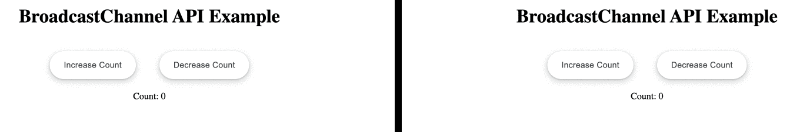

# BroadcastChannel API with Angular Tutorial
#### Reference: [Davy Steegen](https://www.acagroup.be/en/blog/how-to-use-the-broadcastchannel-api-angular/)

## Sending data across tabs on the same browser
